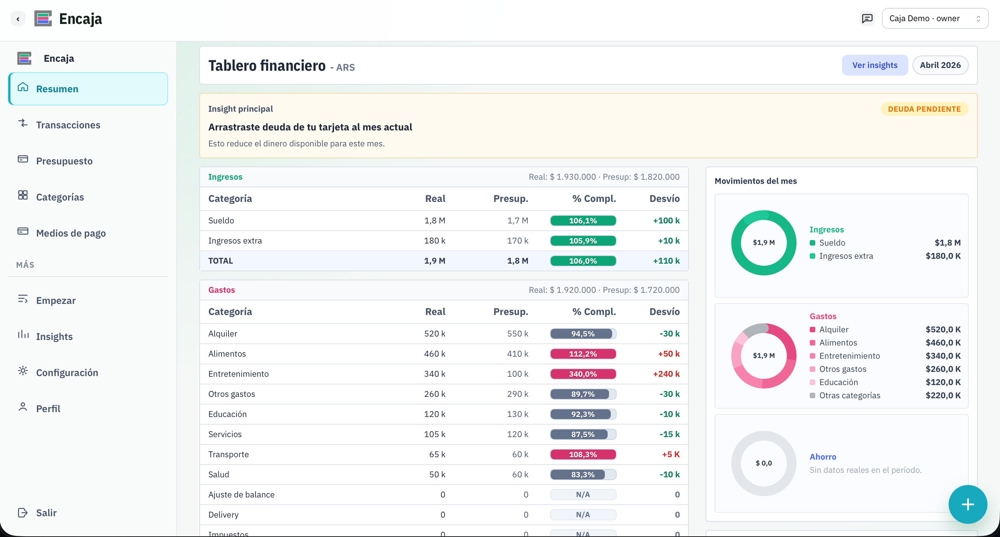
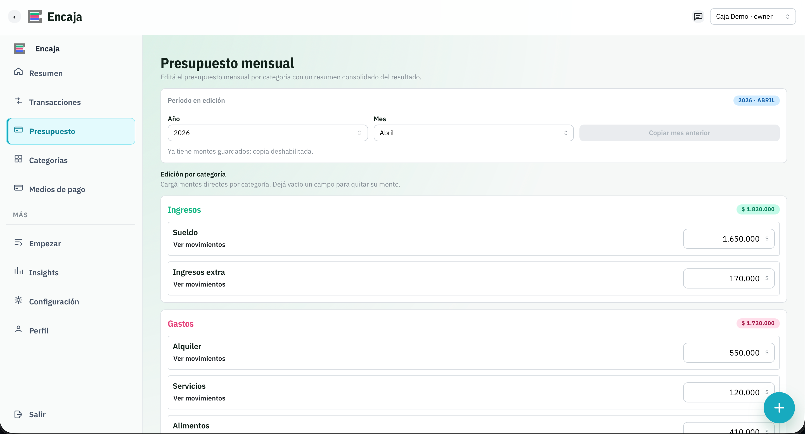
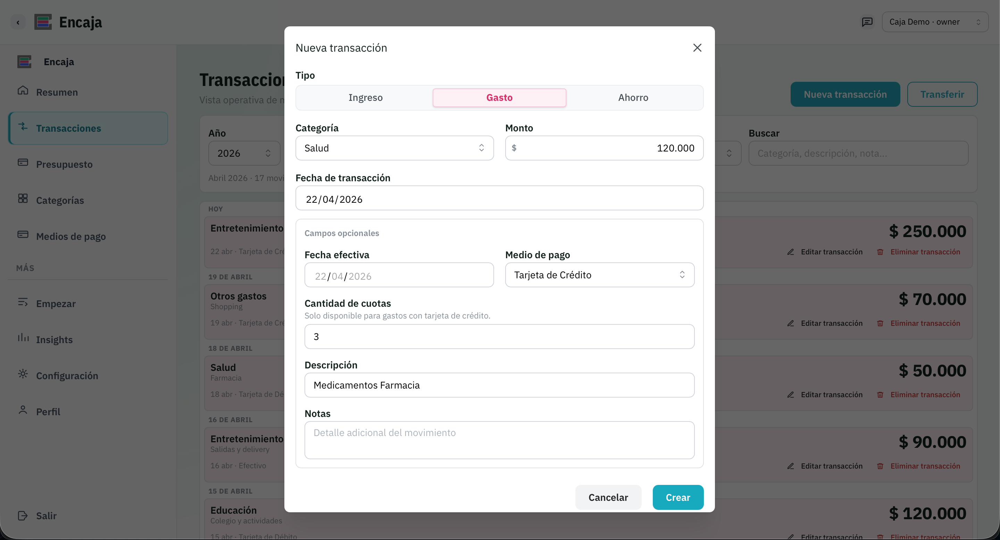
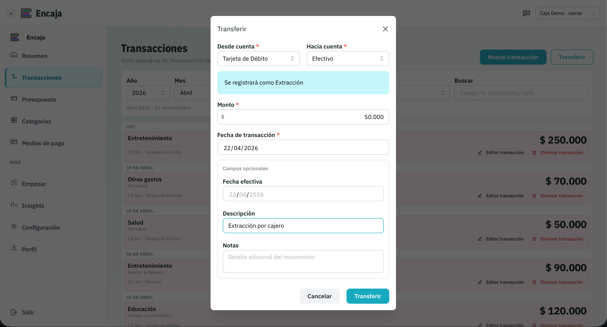
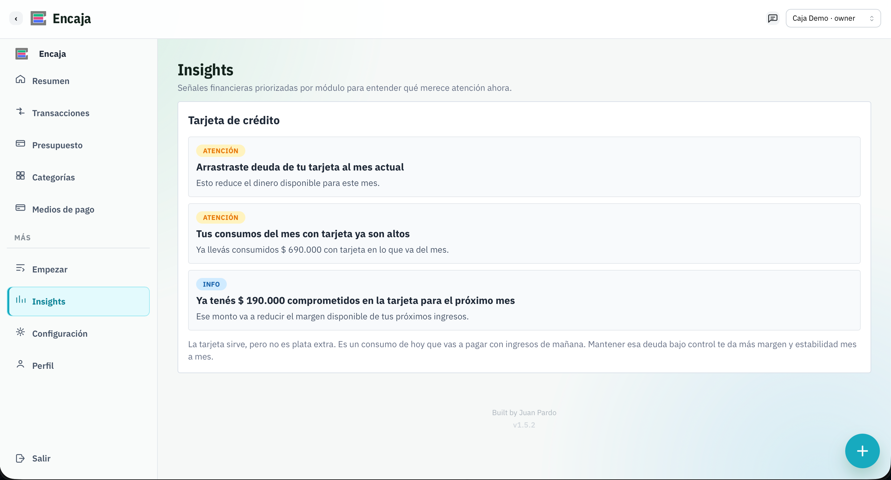

<p align="center">
  
</p>

<h1 align="center">Encaja</h1>

<p align="center">
  Control financiero personal, simple, preciso y sin distorsiones.
</p>

<p align="center">
  
  
  
</p>

<p align="center">
  <a href="https://encaja-app.vercel.app/" target="_blank">
    
  </a>
</p>

# Encaja App

Aplicación web de presupuesto y control financiero personal/workspace-first, nacida desde una lógica de Excel y evolucionada a producto web mantenible.

## Estado actual del producto

- Fase funcional: **MVP26**
- Último release registrado: **1.5.0** (fecha: **2026-04-21**)
- Estado general: base operativa completa para uso real, con onboarding asistido por **Caja Demo**, soporte de compras en cuotas con tarjeta de crédito y foco en robustez de modelo de datos.

### Funcionalidad implementada hoy

- Autenticación con Supabase (`login`, `registro`, `logout`) y sesión persistida.
- Bootstrap automático de usuario + workspace inicial.
- Soporte multi-workspace con switch de contexto.
- Dashboard/resumen financiero por workspace.
- Flujo de onboarding (`/start`) guiado por datos reales.
- Transacciones con `income`, `expense`, `saving` y `transfer` entre medios de pago.
- Compras en cuotas con tarjeta de crédito (distribución mensual, edición del plan y visualización de compromisos futuros).
- Presupuesto mensual por categorías.
- Insights del período.
- Gestión de categorías (catálogo sistema + categorías custom por workspace).
- Gestión de medios de pago y balances.
- Settings del workspace (general, miembros, links entre workspaces, danger zone).
- Perfil de usuario separado de settings (`/profile`).
- Base i18n (`es`/`en`).
- Flujo de creación de **workspace demo** con datos realistas para acelerar onboarding.

## 🚀 Qué hace Encaja

Encaja combina en un mismo flujo:

- 📊 Planificación de presupuesto mensual por categoría
- 💸 Registro de movimientos reales (income, expense, saving, transfer)
- 📈 Análisis de desvíos con insights automáticos
- 🧠 Lectura clara del estado financiero por workspace
- 🏦 Gestión de múltiples "cajas" (workspaces)
- 💳 Control de tarjetas de crédito y compras en cuotas sin distorsión

---

## 📸 Producto

### Dashboard


### Budget


### Transactions


### Transfers


### Insights


## 🛠️ Stack


- Next.js `16.2.3` (App Router)
- React `19.2.4`
- TypeScript
- Mantine
- Supabase (Auth + Postgres + RLS)
- React Hook Form + Zod
- Vitest + ESLint

## Cómo correrlo localmente

### 1) Instalar dependencias

```bash
npm install
```

### 2) Configurar variables de entorno

Copiar `.env.example` a `.env.local` y completar:

```env
NEXT_PUBLIC_SUPABASE_URL=
NEXT_PUBLIC_SUPABASE_PUBLISHABLE_KEY=
```

Compatibilidad legacy opcional:

```env
NEXT_PUBLIC_SUPABASE_ANON_KEY=
```

### 3) Aplicar migraciones de base de datos

Este repo incluye migraciones acumuladas en `supabase/migrations/` (hasta MVP26).

Opciones:

- usar Supabase CLI y aplicar todas en orden (`supabase db push`)
- o ejecutar manualmente los SQL en orden cronológico

### 4) Levantar la app

```bash
npm run dev
```

Abrir [http://localhost:3000](http://localhost:3000).

Nota para entorno Codex: puede requerir `PATH="/usr/local/bin:/opt/homebrew/bin:$PATH"` para comandos de `npm`.

## Scripts útiles

- `npm run dev`: entorno local
- `npm run build`: build de producción
- `npm run lint`: chequeo estático
- `npm run test`: tests de unidad (Vitest)

## Estructura principal del proyecto

- `src/app/(auth)`: login y registro
- `src/app/(protected)/app/[workspaceSlug]`: módulos de la app autenticada
- `src/features`: capas funcionales por dominio
- `src/lib/supabase`: cliente y utilidades de sesión
- `src/lib/workspace/bootstrap.ts`: bootstrap de usuario/workspace
- `supabase/migrations`: modelo de datos y hardening SQL
- `docs/mvps`: definición evolutiva por MVP
- `CHANGELOG.md`: historial de releases y cambios

## Documentación recomendada

- Visión: `docs/01-vision-v1.md`
- Modelo de datos: `docs/02-modelo_de_datos-v1.md`
- Reglas de negocio: `docs/03-reglas_de_negocio-v1.md`
- Lineamientos UI: `docs/04-lineamientos-ui-v1.md`
- Workflow de desarrollo y releases: `docs/dev-workflow.md`
- Historial funcional por MVP: `docs/mvps/`

## 🧭 Roadmap

- 🧠 Insights más inteligentes basados en categorías semánticas
- 🤝 Mejoras en colaboración entre workspaces
- 🔒 Hardening de permisos y políticas RLS
- 📱 Optimización de experiencia mobile

## Autoría

Desarrollado por Juan Pardo.

## Licencia

MIT. Ver [LICENSE](./LICENSE).
